# 🎨 DIAGRAM MERMAID MEMORIAL
## Kumpulan Diagram untuk Konversi ke Gambar

> **Cara Pakai:** Copy-paste kode di bawah ke https://mermaid.live/ lalu download sebagai PNG/SVG

---

## 📋 **1. DIAGRAM STRUKTUR APLIKASI**

```mermaid
graph TD
    A["🏠 RUMAH APLIKASI<br/>(Base Layout)"] --> B["🚪 PINTU MASUK<br/>(Login Page)"]
    A --> C["🏛️ RUANG UTAMA<br/>(Main Dashboard)"]
    
    C --> D["📋 SIDEBAR KIRI<br/>(Navigation Menu)"]
    C --> E["🔧 TOOLBAR ATAS<br/>(Header Navigation)"]
    C --> F["📄 AREA KONTEN<br/>(Main Content Area)"]
    
    D --> D1["📁 Menu Berkas"]
    D --> D2["💰 Menu Accounting"]
    D --> D3["📊 Menu Laporan"]
    D --> D4["⚙️ Menu Utilitas"]
    
    E --> E1["👤 User Info"]
    E --> E2["🔔 Notifications"]
    E --> E3["⚙️ Settings"]
    E --> E4["🚪 Logout"]
    
    F --> G["📝 HALAMAN MEMORIAL<br/>(Memorial Page)"]
    
    G --> H["📌 BREADCRUMB<br/>(Navigasi Lokasi)"]
    G --> I["🏷️ JUDUL HALAMAN<br/>(Data Memorial)"]
    G --> J["🔍 SEARCH BAR<br/>(Pencarian)"]
    G --> K["📊 DATATABLE<br/>(Tabel Data)"]
    
    K --> L["🎯 KOLOM ACTION<br/>(Tombol Aksi)"]
    
    L --> M["📋 Tombol Detail"]
    L --> N["🗑️ Tombol Hapus"]
    L --> O["📄 Tombol PDF"]
    
    style A fill:#e1f5fe,stroke:#01579b,stroke-width:3px,color:#000000
    style G fill:#f3e5f5,stroke:#4a148c,stroke-width:3px,color:#000000
    style L fill:#e8f5e8,stroke:#2e7d32,stroke-width:3px,color:#000000
```



---

## 🏗️ **2. DIAGRAM KOMPONEN LAYOUT**

```mermaid
graph TB
    subgraph "🏠 BASE LAYOUT - app.blade.php"
        A1["<!DOCTYPE html><br/>HTML Structure"]
        A2["<head><br/>CSS & Meta Tags"]
        A3["<body><br/>Main Container"]
        
        A1 --> A2
        A2 --> A3
    end
    
    subgraph "🔧 HEADER TOOLBAR - Bagian Atas"
        B1["🏢 Logo Perusahaan"]
        B2["🍔 Menu Toggle Button"]
        B3["👤 User Dropdown"]
        B4["🔔 Notification Bell"]
        
        B1 --> B2
        B2 --> B3
        B3 --> B4
    end
    
    subgraph "📋 SIDEBAR KIRI - Navigation"
        C1["🏠 Dashboard"]
        C2["📁 Berkas<br/>├── Perusahaan<br/>├── Set Pemakai<br/>└── Master Menu"]
        C3["💰 Accounting<br/>├── Bank/Kas<br/>├── Memorial<br/>└── Posting"]
        C4["📊 Laporan<br/>├── Neraca<br/>├── Laba Rugi<br/>└── Jurnal"]
        C5["⚙️ Utilitas<br/>└── Tutup Buku"]
    end
    
    subgraph "📄 MAIN CONTENT - memorial.blade.php"
        D1["📌 Breadcrumb<br/>Home > Accounting > Memorial"]
        D2["🏷️ Page Title<br/>Data Memorial"]
        D3["🔍 Search Controls<br/>Tanggal, Keterangan, dll"]
        D4["📊 DataTable Container<br/>table.table.table-bordered"]
        D5["🎯 Action Column<br/>width: ~200px"]
    end
    
    A3 --> B1
    A3 --> C1
    A3 --> D1
    
    style A3 fill:#ffffff,stroke:#000000,stroke-width:2px,color:#000000
    style D4 fill:#e8f5e8,stroke:#2e7d32,stroke-width:3px,color:#000000
    style D5 fill:#fff3e0,stroke:#ef6c00,stroke-width:3px,color:#000000
```



---

## 🔄 **3. DIAGRAM ALUR KERJA DATA**

```mermaid
graph LR
    subgraph "🎮 BACKEND FLOW"
        A["Route: /memorial<br/>📍 web.php"]
        B["MemorialController@index<br/>🎮 Controller Method"]
        C["MemorialRepository<br/>📊 Data Repository"]
        D["Database Query<br/>🗄️ SQL Execution"]
        E["JSON Response<br/>📡 API Response"]
        
        A --> B
        B --> C
        C --> D
        D --> E
    end
    
    subgraph "💻 FRONTEND FLOW"
        F["memorial.blade.php<br/>📄 Blade Template"]
        G["memorial.js<br/>⚙️ JavaScript File"]
        H["DataTable AJAX<br/>📡 AJAX Request"]
        I["DOM Manipulation<br/>🎨 HTML Rendering"]
        J["User Interface<br/>👤 Final Display"]
        
        F --> G
        G --> H
        H --> I
        I --> J
    end
    
    subgraph "🔄 DATA PROCESSING"
        K["Raw Database Data<br/>🗄️ dbTrans + dbTransaksi"]
        L["Repository Processing<br/>⚙️ Business Logic"]
        M["Controller Formatting<br/>🎨 Data Formatting"]
        N["JavaScript Rendering<br/>🖥️ Client-side Processing"]
        O["HTML Display<br/>📺 User View"]
        
        K --> L
        L --> M
        M --> N
        N --> O
    end
    
    E --> H
    B --> F
    D --> K
    
    style B fill:#e1f5fe,stroke:#01579b,stroke-width:3px,color:#000000
    style G fill:#fff3e0,stroke:#ef6c00,stroke-width:3px,color:#000000
    style M fill:#e8f5e8,stroke:#2e7d32,stroke-width:3px,color:#000000
```



---

## ⚙️ **4. DIAGRAM JAVASCRIPT WORKFLOW**

```mermaid
graph TD
    subgraph "⚙️ JAVASCRIPT WORKFLOW"
        A["$(document).ready()<br/>🚀 DOM Ready"]
        B["initializeDataTable()<br/>📊 Initialize DataTable"]
        C["setupEventHandlers()<br/>🎯 Setup Event Listeners"]
        D["loadMemorialData()<br/>📡 Load Data via AJAX"]
        
        A --> B
        B --> C
        C --> D
    end
    
    subgraph "📊 DATATABLE INITIALIZATION"
        E["$('#memorialTable').DataTable<br/>📋 DataTable Config"]
        F["serverSide: true<br/>🖥️ Server Processing"]
        G["ajax: '/memorial/data'<br/>📡 AJAX Endpoint"]
        H["columns: array<br/>📄 Column Definitions"]
        I["columnDefs: action column<br/>🎯 Action Column Config"]
        
        E --> F
        E --> G
        E --> H
        E --> I
    end
    
    subgraph "🎯 ACTION BUTTONS RENDERING"
        J["render: function(data, type, row)<br/>🎨 Custom Render Function"]
        K["if (row.IsOtorisasi1 == 0)<br/>🔐 Authorization Check"]
        L["create div container<br/>📦 Container Creation<br/>width: 1px, max-width: 100%, margin: auto"]
        M["add Detail Button<br/>📋 btn btn-info btn-sm"]
        N["add Delete Button<br/>🗑️ btn btn-danger btn-sm"]
        O["add PDF Button<br/>📄 btn btn-success btn-sm"]
        P["close container<br/>📦 End div"]
        
        J --> K
        K --> L
        L --> M
        M --> N
        N --> O
        O --> P
    end
    
    subgraph "🖱️ EVENT HANDLERS"
        Q["Detail Click Handler<br/>📋 Show modal with details"]
        R["Delete Click Handler<br/>🗑️ Confirm and delete record"]
        S["PDF Click Handler<br/>📄 Generate and download PDF"]
        T["Search Form Handler<br/>🔍 Filter table data"]
        
        Q --> R
        R --> S
        S --> T
    end
    
    B --> E
    I --> J
    C --> Q
    
    style A fill:#e1f5fe,stroke:#01579b,stroke-width:3px,color:#000000
    style J fill:#fff3e0,stroke:#ef6c00,stroke-width:3px,color:#000000
    style L fill:#e8f5e8,stroke:#2e7d32,stroke-width:3px,color:#000000
```



---

## 📱 **5. DIAGRAM RESPONSIVITAS**

```mermaid
graph TB
    subgraph "📱 RESPONSIVE LAYOUT"
        A["Desktop > 1200px<br/>🖥️ Full Layout<br/>├── Sidebar: 250px<br/>├── Content: calc(100% - 250px)<br/>└── Action buttons: visible"]
        B["Tablet 768px - 1199px<br/>📱 Medium Layout<br/>├── Sidebar: collapsible<br/>├── Content: full width when collapsed<br/>└── Action buttons: smaller"]
        C["Mobile < 768px<br/>📱 Mobile Layout<br/>├── Sidebar: overlay<br/>├── Content: full width<br/>└── Action buttons: stacked"]
        
        A --> B
        B --> C
    end
    
    subgraph "📊 TABLE RESPONSIVENESS"
        D["DataTable nowrap<br/>📏 No Text Wrapping<br/>├── horizontal scroll on small screens<br/>├── fixed column widths<br/>└── action column always visible"]
        E["Bootstrap Classes<br/>🎨 Responsive Utilities<br/>├── .table-responsive<br/>├── .d-none .d-md-block<br/>└── .btn-sm on mobile"]
        
        D --> E
    end
    
    subgraph "🎯 ACTION COLUMN BEHAVIOR"
        F["Container Styling<br/>📦 width: 1px, max-width: 100%<br/>├── adapts to column width<br/>├── centers content<br/>├── prevents overflow<br/>└── maintains button spacing"]
        G["Button Responsiveness<br/>🔘 Button Behavior<br/>├── font-size: 12px<br/>├── padding: 5px 10px<br/>├── margin: 2px<br/>└── stacks on very small screens"]
        
        F --> G
    end
    
    subgraph "🔍 SEARCH BAR ADAPTATION"
        H["Search Form Layout<br/>🔍 Form Responsiveness<br/>├── full width on mobile<br/>├── inline on desktop<br/>├── collapsible advanced options<br/>└── touch-friendly buttons"]
        I["Input Field Behavior<br/>📝 Input Responsiveness<br/>├── larger touch targets<br/>├── appropriate keyboard types<br/>├── clear validation messages<br/>└── accessible labels"]
        
        H --> I
    end
    
    A --> D
    C --> F
    B --> H
    
    style A fill:#e1f5fe,stroke:#01579b,stroke-width:3px,color:#000000
    style F fill:#e8f5e8,stroke:#2e7d32,stroke-width:3px,color:#000000
    style H fill:#fff3e0,stroke:#ef6c00,stroke-width:3px,color:#000000
```



---

## ❌✅ **6. DIAGRAM MASALAH DAN SOLUSI**

```mermaid
graph TB
    subgraph "❌ MASALAH YANG DITEMUKAN"
        A1["🏠 Base Layout<br/>❌ Tidak ada masalah<br/>✅ Berfungsi normal"]
        A2["📋 Sidebar Menu<br/>❌ Tidak ada masalah<br/>✅ Navigation berfungsi"]
        A3["🔧 Header Toolbar<br/>❌ Tidak ada masalah<br/>✅ User menu berfungsi"]
        A4["📄 Page Title<br/>❌ Tidak ada masalah<br/>✅ Breadcrumb berfungsi"]
        A5["🔍 Search Bar<br/>❌ Tidak ada masalah<br/>✅ Filter berfungsi"]
        A6["📊 DataTable<br/>❌ Class CSS kurang lengkap<br/>❌ table vs table table-bordered"]
        A7["🎯 Action Column<br/>❌ Container width salah<br/>❌ width: auto vs width: 1px"]
        A8["🔘 Action Buttons<br/>❌ Tidak muncul<br/>❌ Terpotong di container"]
        
        A1 --- A2
        A2 --- A3
        A3 --- A4
        A4 --- A5
        A5 --- A6
        A6 --- A7
        A7 --- A8
    end
    
    subgraph "✅ SOLUSI YANG DITERAPKAN"
        B1["🏠 Base Layout<br/>✅ Tetap menggunakan app.blade.php<br/>✅ Struktur HTML standar"]
        B2["📋 Sidebar Menu<br/>✅ Tetap menggunakan AdminLTE<br/>✅ Navigation tree berfungsi"]
        B3["🔧 Header Toolbar<br/>✅ Tetap menggunakan navbar<br/>✅ User dropdown berfungsi"]
        B4["📄 Page Title<br/>✅ Tetap menggunakan breadcrumb<br/>✅ 'Data Memorial' title"]
        B5["🔍 Search Bar<br/>✅ Tetap menggunakan form<br/>✅ Bootstrap form-control"]
        B6["📊 DataTable<br/>✅ Tambah class CSS lengkap<br/>✅ table table-bordered table-striped table-hover nowrap w-100"]
        B7["🎯 Action Column<br/>✅ Ubah container styling<br/>✅ width: 1px; max-width: 100%; margin: auto"]
        B8["🔘 Action Buttons<br/>✅ Sekarang muncul dengan benar<br/>✅ Terpusat dan responsive"]
        
        B1 --- B2
        B2 --- B3
        B3 --- B4
        B4 --- B5
        B5 --- B6
        B6 --- B7
        B7 --- B8
    end
    
    subgraph "🔄 PERBANDINGAN SEBELUM vs SESUDAH"
        C1["SEBELUM<br/>❌ memorial.blade.php:<br/>table class='table'<br/>❌ MemorialController.php:<br/>width: auto; min-width: 300px<br/>❌ Tombol tidak muncul"]
        C2["SESUDAH<br/>✅ memorial.blade.php:<br/>table class='table table-bordered table-striped table-hover nowrap w-100'<br/>✅ MemorialController.php:<br/>width: 1px; max-width: 100%; margin: auto<br/>✅ Tombol muncul dengan benar"]
        
        C1 --> C2
    end
    
    A6 --> B6
    A7 --> B7
    A8 --> B8
    
    style A6 fill:#ffebee,stroke:#c62828,stroke-width:3px,color:#000000
    style A7 fill:#ffebee,stroke:#c62828,stroke-width:3px,color:#000000
    style A8 fill:#ffebee,stroke:#c62828,stroke-width:3px,color:#000000
    style B6 fill:#e8f5e8,stroke:#2e7d32,stroke-width:3px,color:#000000
    style B7 fill:#e8f5e8,stroke:#2e7d32,stroke-width:3px,color:#000000
    style B8 fill:#e8f5e8,stroke:#2e7d32,stroke-width:3px,color:#000000
```



---

## 📝 **CARA MENGGUNAKAN:**

### **Step 1: Copy Kode**
1. Pilih salah satu diagram di atas
2. Copy seluruh kode dalam blok ```mermaid

### **Step 2: Buka Mermaid Live**
1. Buka: https://mermaid.live/
2. Hapus contoh yang ada
3. Paste kode yang sudah dicopy

### **Step 3: Download Gambar**
1. Klik "Download PNG" untuk gambar raster
2. Atau klik "Download SVG" untuk gambar vektor
3. Simpan dengan nama yang sesuai

### **Step 4: Gunakan Gambar**
1. Masukkan ke dokumentasi
2. Sisipkan ke presentasi
3. Bagikan ke tim

---

## 🎯 **TIPS:**

- **PNG:** Untuk dokumentasi dan presentasi
- **SVG:** Untuk web dan scaling tanpa batas
- **Mermaid Live:** Gratis dan mudah digunakan
- **Batch Convert:** Copy semua diagram sekaligus

Sekarang Anda punya file terpisah khusus untuk convert diagram Mermaid ke gambar! 🎨