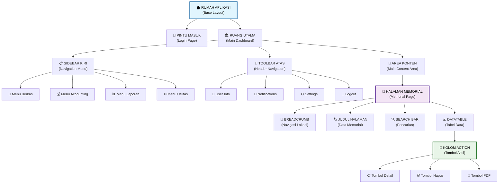
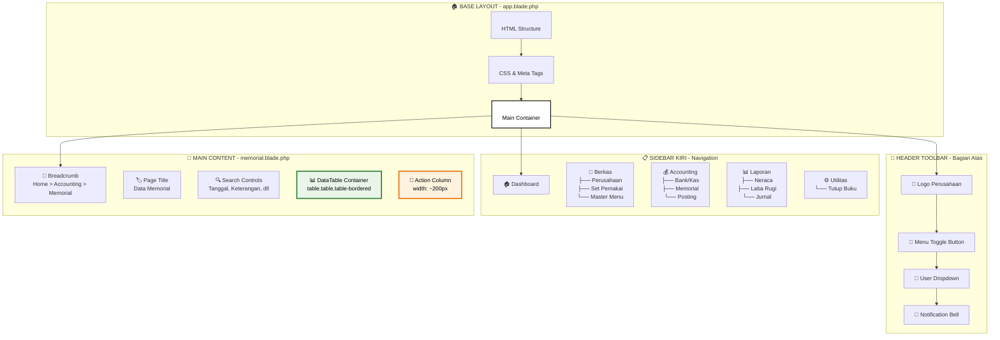
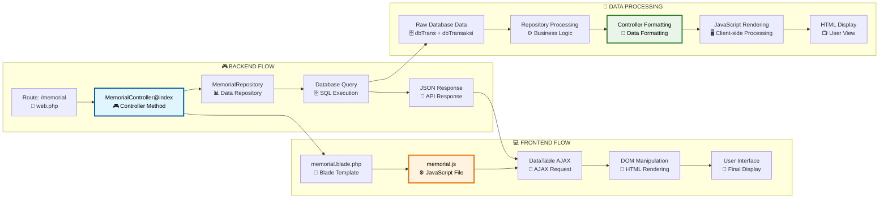
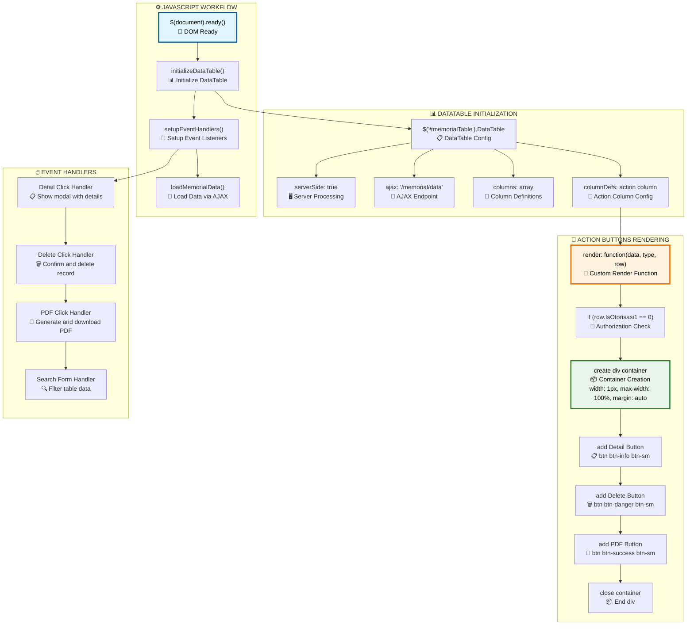
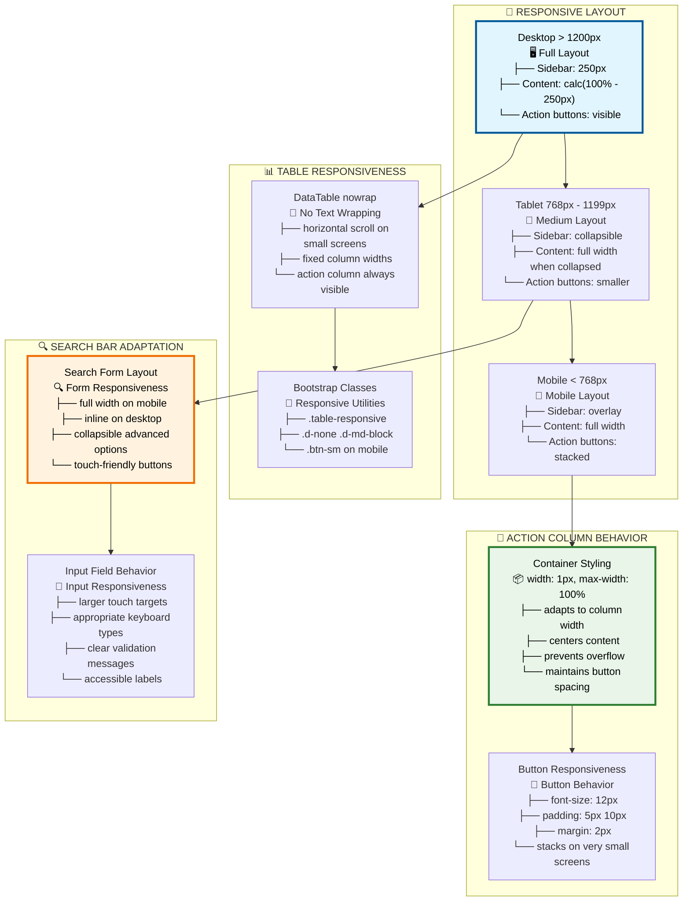
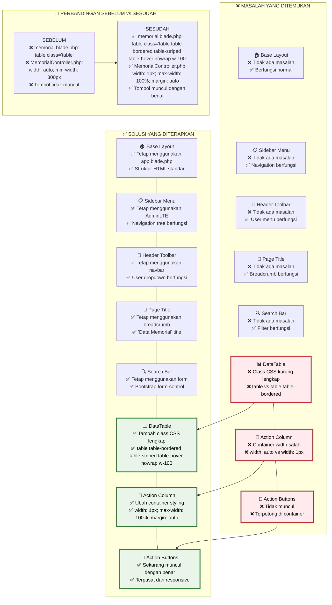

# 🏠 PANDUAN TAMPILAN MEMORIAL LENGKAP
## Dokumentasi Komprehensif Layout & Responsivitas

---

## 📋 DAFTAR ISI
1. [Struktur File yang Digunakan](#struktur-file)
2. [Layout Utama Browser](#layout-utama)
3. [Header Toolbar](#header-toolbar)
4. [Sidebar Navigation](#sidebar-navigation)
5. [Content Area](#content-area)
6. [DataTable Structure](#datatable-structure)
7. [Action Column & Buttons](#action-column)
8. [Expanded Table Detail](#expanded-table)
9. [Responsivitas Perangkat](#responsivitas)
10. [Masalah dan Solusi](#masalah-solusi)

---

## 🎨 DIAGRAM ARSITEKTUR APLIKASI

### Diagram Struktur Aplikasi Keseluruhan



### Diagram Komponen Layout Detail



### Diagram Alur Kerja Data



### Diagram JavaScript Workflow



### Diagram Responsivitas Layout



### Diagram Masalah dan Solusi (Visual ASCII Art)

```
┌─────────────────────────────────────────────────────────────────────────────────────┐
│                           ❌ MASALAH YANG DITEMUKAN                                 │
├─────────────────────────────────────────────────────────────────────────────────────┤
│                                                                                     │
│ 🏠 Base Layout          ✅ Tidak ada masalah - Berfungsi normal                    │
│ 📋 Sidebar Menu         ✅ Tidak ada masalah - Navigation berfungsi               │
│ 🔧 Header Toolbar       ✅ Tidak ada masalah - User menu berfungsi                │
│ 📄 Page Title           ✅ Tidak ada masalah - Breadcrumb berfungsi               │
│ 🔍 Search Bar           ✅ Tidak ada masalah - Filter berfungsi                   │
│                                                                                     │
│ ┌─────────────────────────────────────────────────────────────────────────────────┐ │
│ │ 📊 DataTable          ❌ MASALAH: Class CSS kurang lengkap                     │ │
│ │                       ❌ table vs table table-bordered                         │ │
│ └─────────────────────────────────────────────────────────────────────────────────┘ │
│                                                                                     │
│ ┌─────────────────────────────────────────────────────────────────────────────────┐ │
│ │ 🎯 Action Column      ❌ MASALAH: Container width salah                        │ │
│ │                       ❌ width: auto vs width: 1px                             │ │
│ └─────────────────────────────────────────────────────────────────────────────────┘ │
│                                                                                     │
│ ┌─────────────────────────────────────────────────────────────────────────────────┐ │
│ │ 🔘 Action Buttons     ❌ MASALAH: Tidak muncul                                 │ │
│ │                       ❌ Terpotong di container                                 │ │
│ └─────────────────────────────────────────────────────────────────────────────────┘ │
│                                                                                     │
└─────────────────────────────────────────────────────────────────────────────────────┘

                                        ⬇️ PERBAIKAN ⬇️

┌─────────────────────────────────────────────────────────────────────────────────────┐
│                           ✅ SOLUSI YANG DITERAPKAN                                 │
├─────────────────────────────────────────────────────────────────────────────────────┤
│                                                                                     │
│ 🏠 Base Layout          ✅ Tetap menggunakan app.blade.php                        │
│                         ✅ Struktur HTML standar                                   │
│                                                                                     │
│ 📋 Sidebar Menu         ✅ Tetap menggunakan AdminLTE                             │
│                         ✅ Navigation tree berfungsi                               │
│                                                                                     │
│ 🔧 Header Toolbar       ✅ Tetap menggunakan navbar                               │
│                         ✅ User dropdown berfungsi                                 │
│                                                                                     │
│ 📄 Page Title           ✅ Tetap menggunakan breadcrumb                           │
│                         ✅ 'Data Memorial' title                                   │
│                                                                                     │
│ 🔍 Search Bar           ✅ Tetap menggunakan form                                 │
│                         ✅ Bootstrap form-control                                  │
│                                                                                     │
│ ┌─────────────────────────────────────────────────────────────────────────────────┐ │
│ │ 📊 DataTable          ✅ DIPERBAIKI: Tambah class CSS lengkap                  │ │
│ │                       ✅ table table-bordered table-striped table-hover        │ │
│ │                       ✅ nowrap w-100                                           │ │
│ └─────────────────────────────────────────────────────────────────────────────────┘ │
│                                                                                     │
│ ┌─────────────────────────────────────────────────────────────────────────────────┐ │
│ │ 🎯 Action Column      ✅ DIPERBAIKI: Ubah container styling                    │ │
│ │                       ✅ width: 1px; max-width: 100%; margin: auto             │ │
│ └─────────────────────────────────────────────────────────────────────────────────┘ │
│                                                                                     │
│ ┌─────────────────────────────────────────────────────────────────────────────────┐ │
│ │ 🔘 Action Buttons     ✅ DIPERBAIKI: Sekarang muncul dengan benar              │ │
│ │                       ✅ Terpusat dan responsive                                │ │
│ └─────────────────────────────────────────────────────────────────────────────────┘ │
│                                                                                     │
└─────────────────────────────────────────────────────────────────────────────────────┘

┌─────────────────────────────────────────────────────────────────────────────────────┐
│                      🔄 PERBANDINGAN SEBELUM vs SESUDAH                             │
├─────────────────────────────────────────────────────────────────────────────────────┤
│                                                                                     │
│ ❌ SEBELUM:                                                                         │
│ ┌─────────────────────────────────────────────────────────────────────────────────┐ │
│ │ memorial.blade.php:                                                             │ │
│ │ <table class="table">                                                           │ │
│ │                                                                                 │ │
│ │ MemorialController.php:                                                         │ │
│ │ width: auto; min-width: 300px                                                   │ │
│ │                                                                                 │ │
│ │ HASIL: ❌ Tombol tidak muncul                                                   │ │
│ └─────────────────────────────────────────────────────────────────────────────────┘ │
│                                                                                     │
│                                    ⬇️ DIPERBAIKI ⬇️                                │
│                                                                                     │
│ ✅ SESUDAH:                                                                         │
│ ┌─────────────────────────────────────────────────────────────────────────────────┐ │
│ │ memorial.blade.php:                                                             │ │
│ │ <table class="table table-bordered table-striped table-hover nowrap w-100">    │ │
│ │                                                                                 │ │
│ │ MemorialController.php:                                                         │ │
│ │ width: 1px; max-width: 100%; margin: auto                                       │ │
│ │                                                                                 │ │
│ │ HASIL: ✅ Tombol muncul dengan benar                                            │ │
│ └─────────────────────────────────────────────────────────────────────────────────┘ │
│                                                                                     │
└─────────────────────────────────────────────────────────────────────────────────────┘
```

### Visualisasi Action Column Problem & Solution

```
❌ MASALAH CONTAINER ACTION COLUMN:

Laci Action Column (200px)
┌─────────────────────┐
│ [Wadah terlalu besar (300px)] → Overflow! Tombol terpotong
│ Tidak terlihat karena keluar dari laci
└─────────────────────┘

CSS Bermasalah:
div style="width: auto; min-width: 300px"

---

✅ SOLUSI CONTAINER ACTION COLUMN:

Laci Action Column (200px)
┌─────────────────────┐
│   [Wadah pas (1px)] │ ← Container menyesuaikan laci
│   [📋] [🗑️] [📄]   │ ← Tombol terpusat dan terlihat
└─────────────────────┘

CSS Diperbaiki:
div style="width: 1px; max-width: 100%; margin: auto"
```

### Diagram Mermaid (Untuk Platform yang Mendukung)



---

## 📁 STRUKTUR FILE YANG DIGUNAKAN

### Backend Files:
- `app/Http/Controllers/MemorialController.php` - Controller utama
- `app/Http/Repository/MemorialRepository.php` - Data access layer
- `routes/web.php` - Routing definition

### Frontend Files:
- `resources/views/layouts/app.blade.php` - Base layout
- `resources/views/accounting/memorial.blade.php` - Memorial page
- `public/assets/js/accounting/memorial.js` - JavaScript logic
- `public/assets/js/accounting/memorial-detail.js` - Detail expansion
- `public/assets/js/base-function.js` - Shared functions
- `public/assets/css/adminlte.css` - Main styling

---

## 🖥️ LAYOUT UTAMA BROWSER

### Desktop Layout (1920x1080)
```
┌─────────────────────────────────────────────────────────────────────────────────────┐
│                           🔧 HEADER TOOLBAR (Height: 57px)                          │
│ File: layouts/app.blade.php + adminlte.css                                          │
├─────────────────────────────────────────────────────────────────────────────────────┤
│ 📋 SIDEBAR    │                    📄 CONTENT AREA                                  │
│ (Width: 250px)│              (Width: calc(100vw - 250px))                          │
│               │                                                                     │
│ File:         │ File: accounting/memorial.blade.php                                │
│ app.blade.php │ + memorial.js                                                      │
│               │                                                                     │
│ 🏠 Dashboard  │ 📌 Breadcrumb: Home > Accounting > Memorial                        │
│ 📁 Berkas     │ 🏷️ Page Title: Data Memorial                                       │
│ 💰 Accounting │ 🔍 Search Controls                                                 │
│   ├─Bank/Kas  │ 📊 DataTable Container                                             │
│   ├─Memorial⭐│                                                                     │
│   └─Posting   │                                                                     │
│ 📊 Laporan    │                                                                     │
│ ⚙️ Utilitas   │                                                                     │
│               │                                                                     │
└───────────────┴─────────────────────────────────────────────────────────────────────┘
```

### Tablet Layout (768px - 1199px)
```
┌─────────────────────────────────────────────────────────────────────────────────────┐
│                           🔧 HEADER TOOLBAR (Height: 57px)                          │
│ 🍔 Collapsible Menu Toggle                                                          │
├─────────────────────────────────────────────────────────────────────────────────────┤
│                              📄 CONTENT AREA                                        │
│                            (Full Width: 100vw)                                      │
│                                                                                     │
│ 📋 SIDEBAR (Overlay when opened)                                                   │
│ ┌─────────────────┐                                                               │
│ │ 🏠 Dashboard    │ 📌 Breadcrumb                                                 │
│ │ 📁 Berkas       │ 🏷️ Data Memorial                                              │
│ │ 💰 Accounting   │ 🔍 Search (Stacked)                                           │
│ │ 📊 Laporan      │ 📊 DataTable (Horizontal Scroll)                              │
│ │ ⚙️ Utilitas     │                                                               │
│ └─────────────────┘                                                               │
│                                                                                     │
└─────────────────────────────────────────────────────────────────────────────────────┘
```

### Mobile Layout (<768px)
```
┌─────────────────────────────────────────────────────────────────────────────────────┐
│                    🔧 HEADER TOOLBAR (Height: 57px)                                 │
│ 🍔 Menu  📱 Mobile View                                    👤 User                  │
├─────────────────────────────────────────────────────────────────────────────────────┤
│                              📄 CONTENT AREA                                        │
│                            (Full Width: 100vw)                                      │
│                                                                                     │
│ 📌 Breadcrumb (Smaller text)                                                       │
│ 🏷️ Data Memorial                                                                   │
│ 🔍 Search Controls (Stacked vertically)                                            │
│ ┌─────────────────────────────────────────────────────────────────────────────────┐ │
│ │ 📊 DataTable (Horizontal scroll + Touch-friendly)                              │ │
│ │ Action buttons stacked vertically                                              │ │
│ └─────────────────────────────────────────────────────────────────────────────────┘ │
│                                                                                     │
└─────────────────────────────────────────────────────────────────────────────────────┘
```

---

## 🔧 HEADER TOOLBAR

**File:** `resources/views/layouts/app.blade.php`
**CSS:** `public/assets/css/adminlte.css`

```
┌─────────────────────────────────────────────────────────────────────────────────────┐
│ 🏢 Logo      🍔 Toggle    🔍 Global Search         🔔 Notif  👤 User  🚪 Logout      │
│ (0-200px)   (200-250px)   (250-800px)            (800-1000px) (1000-1200px)        │
│                                                                                     │
│ Classes: .main-header .navbar .navbar-expand .navbar-white .navbar-light          │
│ Position: fixed, top: 0, left: 0, right: 0, height: 57px, z-index: 1000          │
└─────────────────────────────────────────────────────────────────────────────────────┘
```

### Responsivitas Header:
- **Desktop (>1200px):** Semua elemen visible, full width
- **Tablet (768-1199px):** Search bar menyempit, beberapa menu collapsed
- **Mobile (<768px):** Hanya logo, toggle, dan user menu visible

---

## 📋 SIDEBAR NAVIGATION

**File:** `resources/views/layouts/app.blade.php`
**CSS:** `.main-sidebar .sidebar-dark-primary`

```
┌─────────────────────────────────────────────────────────────────────────────────────┐
│                    📋 SIDEBAR MENU (Width: 250px)                                   │
│ File: layouts/app.blade.php                                                         │
│                                                                                     │
│ ┌─────────────────────────────────────────────────────────────────────────────────┐ │
│ │ 🏠 Dashboard                                                                    │ │
│ │    Route: /dashboard                                                            │ │
│ ├─────────────────────────────────────────────────────────────────────────────────┤ │
│ │ 📁 Berkas                                                                       │ │
│ │    ├── 🏢 Perusahaan                                                            │ │
│ │    ├── 👤 Set Pemakai                                                           │ │
│ │    └── 📋 Master Menu                                                           │ │
│ ├─────────────────────────────────────────────────────────────────────────────────┤ │
│ │ 💰 Accounting                                                                   │ │
│ │    ├── 🏦 Bank/Kas                                                              │ │
│ │    ├── 📝 Memorial ⭐ (Active)                                                  │ │
│ │    └── 📊 Posting                                                               │ │
│ ├─────────────────────────────────────────────────────────────────────────────────┤ │
│ │ 📊 Laporan                                                                      │ │
│ │    ├── 📈 Neraca                                                                │ │
│ │    ├── 💹 Laba Rugi                                                             │ │
│ │    └── 📋 Jurnal                                                                │ │
│ ├─────────────────────────────────────────────────────────────────────────────────┤ │
│ │ ⚙️ Utilitas                                                                     │ │
│ │    └── 🔒 Tutup Buku                                                            │ │
│ └─────────────────────────────────────────────────────────────────────────────────┘ │
│                                                                                     │
│ Position: fixed, left: 0, top: 57px, height: calc(100vh - 57px)                   │
│ Classes: .main-sidebar .sidebar-dark-primary .elevation-4                         │
└─────────────────────────────────────────────────────────────────────────────────────┘
```

### Responsivitas Sidebar:
- **Desktop (>1200px):** Fixed width 250px, always visible
- **Tablet (768-1199px):** Collapsible, overlay on content
- **Mobile (<768px):** Full overlay, swipe gestures supported

---

## 📄 CONTENT AREA

**File:** `resources/views/accounting/memorial.blade.php`
**CSS:** `.content-wrapper`

```
┌─────────────────────────────────────────────────────────────────────────────────────┐
│                              📄 CONTENT WRAPPER                                     │
│ File: accounting/memorial.blade.php                                                 │
│ Position: margin-left: 250px, margin-top: 57px                                     │
│                                                                                     │
│ ┌─────────────────────────────────────────────────────────────────────────────────┐ │
│ │ 📌 BREADCRUMB SECTION (Height: 40px)                                           │ │
│ │ Home > Accounting > Memorial                                                    │ │
│ │ Classes: .content-header .container-fluid                                      │ │
│ └─────────────────────────────────────────────────────────────────────────────────┘ │
│                                                                                     │
│ ┌─────────────────────────────────────────────────────────────────────────────────┐ │
│ │ 🏷️ PAGE TITLE SECTION (Height: 60px)                                          │ │
│ │ <h1>Data Memorial</h1>                                                         │ │
│ │ Classes: .content-header h1                                                    │ │
│ └─────────────────────────────────────────────────────────────────────────────────┘ │
│                                                                                     │
│ ┌─────────────────────────────────────────────────────────────────────────────────┐ │
│ │ 🔍 SEARCH CONTROLS SECTION (Height: 80px)                                      │ │
│ │ [Tanggal Dari] [Tanggal Sampai] [Keterangan] [🔍 Search] [🔄 Reset]           │ │
│ │ Classes: .form-row .col-md-* .form-control                                     │ │
│ └─────────────────────────────────────────────────────────────────────────────────┘ │
│                                                                                     │
│ ┌─────────────────────────────────────────────────────────────────────────────────┐ │
│ │                      📊 DATATABLE CONTAINER                                     │ │
│ │ Height: calc(100vh - 237px)                                                    │ │
│ │ Classes: .card .card-body                                                      │ │
│ │ File: memorial.js (JavaScript logic)                                           │ │
│ └─────────────────────────────────────────────────────────────────────────────────┘ │
└─────────────────────────────────────────────────────────────────────────────────────┘
```

### Responsivitas Content Area:
- **Desktop (>1200px):** margin-left: 250px (sidebar width)
- **Tablet (768-1199px):** margin-left: 0 (sidebar collapsed)
- **Mobile (<768px):** Full width, padding adjusted

---

## 📊 DATATABLE STRUCTURE

**File:** `resources/views/accounting/memorial.blade.php` + `public/assets/js/accounting/memorial.js`

```
┌─────────────────────────────────────────────────────────────────────────────────────┐
│                              📊 DATATABLE CONTAINER                                 │
│ <table id="memorialTable" class="table table-bordered table-striped                │
│        table-hover nowrap w-100">                                                   │
│                                                                                     │
│ ┌─────────────────────────────────────────────────────────────────────────────────┐ │
│ │ 📋 TABLE HEADER (Height: 45px)                                                 │ │
│ │ ┌─────┬─────────┬─────────┬─────────┬─────────┬─────────┬─────────┬─────────┐ │ │
│ │ │  +  │ No Bukti│ Tanggal │ Keterangan│ Debet │ Kredit │ Otorisasi│ Action │ │ │
│ │ │(40px)│ (120px) │ (100px) │ (200px) │(100px)│(100px) │ (100px) │(200px) │ │ │
│ │ └─────┴─────────┴─────────┴─────────┴─────────┴─────────┴─────────┴─────────┘ │ │
│ └─────────────────────────────────────────────────────────────────────────────────┘ │
│                                                                                     │
│ ┌─────────────────────────────────────────────────────────────────────────────────┐ │
│ │ 📄 TABLE BODY (Variable height)                                                │ │
│ │ ┌─────┬─────────┬─────────┬─────────┬─────────┬─────────┬─────────┬─────────┐ │ │
│ │ │  -  │ MEM001  │01/01/24 │Kas Masuk│1000000 │       0│    ✓    │[Buttons]│ │ │
│ │ │  +  │ MEM002  │01/01/24 │Kas Keluar│      0│ 500000│    ✓    │[Buttons]│ │ │
│ │ │  -  │ MEM003  │01/01/24 │Transfer │ 750000│ 750000│    ✗    │[Buttons]│ │ │
│ │ └─────┴─────────┴─────────┴─────────┴─────────┴─────────┴─────────┴─────────┘ │ │
│ └─────────────────────────────────────────────────────────────────────────────────┘ │
│                                                                                     │
│ Classes: .table .table-bordered .table-striped .table-hover .nowrap .w-100         │
│ JavaScript: memorial.js - DataTable initialization                                 │
└─────────────────────────────────────────────────────────────────────────────────────┘
```

### Responsivitas DataTable:
- **Desktop (>1200px):** All columns visible, fixed layout
- **Tablet (768-1199px):** Horizontal scroll, priority columns
- **Mobile (<768px):** Responsive collapse, stacked display

---

## 🎯 ACTION COLUMN & BUTTONS

**File:** `app/Http/Controllers/MemorialController.php` (render function)

### ❌ MASALAH SEBELUMNYA:
```
Laci Action Column (200px)
┌─────────────────────┐
│ [Wadah terlalu besar (300px)] → Overflow!
│ Tombol tidak terlihat karena keluar dari laci
└─────────────────────┘

CSS Bermasalah:
div style="width: auto; min-width: 300px"
```

### ✅ SOLUSI SEKARANG:
```
Laci Action Column (200px)
┌─────────────────────┐
│  [Wadah pas (1px)]  │ ← Container menyesuaikan
│  [📋] [🗑️] [📄]    │
└─────────────────────┘

CSS Diperbaiki:
div style="width: 1px; max-width: 100%; margin: auto"
```

### Detail Action Buttons:
```
┌─────────────────────────────────────────────────────────────────────────────────────┐
│                              🎯 ACTION COLUMN                                       │
│ File: MemorialController.php (line ~150-180)                                       │
│                                                                                     │
│ ┌─────────────────────────────────────────────────────────────────────────────────┐ │
│ │                        📦 BUTTON CONTAINER                                      │ │
│ │ <div style="width: 1px; max-width: 100%; margin: auto">                        │ │
│ │                                                                                 │ │
│ │ ┌─────────┬─────────┬─────────┐                                                │ │
│ │ │ 📋 Detail│🗑️ Hapus │📄 PDF   │                                               │ │
│ │ │ btn-info │btn-danger│btn-success│                                             │ │
│ │ │ (60px)  │ (60px)  │ (60px)  │                                               │ │
│ │ └─────────┴─────────┴─────────┘                                                │ │
│ │                                                                                 │ │
│ │ Total width: ~180px (fit dalam kolom 200px)                                    │ │
│ └─────────────────────────────────────────────────────────────────────────────────┘ │
│                                                                                     │
│ Authorization Logic:                                                                │
│ if (row.IsOtorisasi1 == 0) { // Hanya cek otorisasi1                              │
│     return buttons; // Tampilkan tombol                                            │
│ } else {                                                                            │
│     return '-'; // Sembunyikan tombol                                              │
│ }                                                                                   │
└─────────────────────────────────────────────────────────────────────────────────────┘
```

### Responsivitas Action Buttons:
- **Desktop (>1200px):** 3 buttons horizontal, 60px each
- **Tablet (768-1199px):** Buttons smaller, 50px each
- **Mobile (<768px):** Buttons stacked vertically, full width

---

## 📋 EXPANDED TABLE DETAIL

**File:** `public/assets/js/accounting/memorial-detail.js`
**Function:** `getMemorialDetailByNoBukti()`

```
┌─────────────────────────────────────────────────────────────────────────────────────┐
│                           📋 EXPANDED ROW DETAIL                                    │
│ Function: getMemorialDetailByNoBukti(noBukti)                                      │
│ File: memorial-detail.js                                                           │
│                                                                                     │
│ ┌─────────────────────────────────────────────────────────────────────────────────┐ │
│ │                        🔍 DETAIL HEADER                                         │ │
│ │ Detail Memorial: MEM001 - Kas Masuk                                             │ │
│ │ Tanggal: 01/01/2024 | Total: Rp 1,000,000                                      │ │
│ └─────────────────────────────────────────────────────────────────────────────────┘ │
│                                                                                     │
│ ┌─────────────────────────────────────────────────────────────────────────────────┐ │
│ │                      📊 DETAIL DATATABLE                                        │ │
│ │ <table id="memorialDetailTable" class="table table-sm table-bordered">         │ │
│ │ ┌─────┬─────────────┬─────────────┬─────────────┬─────────────┬─────────────┐ │ │
│ │ │ No  │ Kode Akun   │ Nama Akun   │ Keterangan  │ Debet       │ Kredit      │ │ │
│ │ │(40px)│ (100px)     │ (200px)     │ (200px)     │ (120px)     │ (120px)     │ │ │
│ │ ├─────┼─────────────┼─────────────┼─────────────┼─────────────┼─────────────┤ │ │
│ │ │  1  │ 1101        │ Kas         │ Penerimaan  │ 1,000,000   │           0 │ │ │
│ │ │  2  │ 4101        │ Pendapatan  │ Jasa        │         0   │ 1,000,000   │ │ │
│ │ └─────┴─────────────┴─────────────┴─────────────┴─────────────┴─────────────┘ │ │
│ │                                                                                 │ │
│ │ JavaScript Logic:                                                               │ │
│ │ - AJAX call to /memorial/detail/{noBukti}                                       │ │
│ │ - Dynamic table creation                                                        │ │
│ │ - Accounting validation (Debet = Kredit)                                       │ │
│ └─────────────────────────────────────────────────────────────────────────────────┘ │
│                                                                                     │
│ ┌─────────────────────────────────────────────────────────────────────────────────┐ │
│ │                        💰 SUMMARY FOOTER                                        │ │
│ │ Total Debet: Rp 1,000,000 | Total Kredit: Rp 1,000,000 | Balance: ✓          │ │
│ │ Status: Balanced | Created: 01/01/2024 | User: Admin                           │ │
│ └─────────────────────────────────────────────────────────────────────────────────┘ │
└─────────────────────────────────────────────────────────────────────────────────────┘
```

### Responsivitas Expanded Detail:
- **Desktop (>1200px):** Full table width, all columns visible
- **Tablet (768-1199px):** Horizontal scroll, condensed layout
- **Mobile (<768px):** Stacked cards, vertical layout

---

## 📱 RESPONSIVITAS PERANGKAT

### 🖥️ Desktop (>1200px)
```
Layout: Fixed Sidebar + Full Content
┌─────────────────────────────────────────────────────────────────────────────────────┐
│ Header: Full width, all elements visible                                           │
├─────────────────────────────────────────────────────────────────────────────────────┤
│ Sidebar │ Content Area                                                             │
│ 250px   │ calc(100vw - 250px)                                                     │
│ Fixed   │ - Breadcrumb: inline                                                    │
│ Always  │ - Search: 4 columns inline                                              │
│ Visible │ - DataTable: all columns visible                                        │
│         │ - Action buttons: 3 horizontal                                          │
└─────────┴─────────────────────────────────────────────────────────────────────────────┘
```

### 📱 Tablet (768px - 1199px)
```
Layout: Collapsible Sidebar + Responsive Content
┌─────────────────────────────────────────────────────────────────────────────────────┐
│ Header: Toggle visible, search condensed                                           │
├─────────────────────────────────────────────────────────────────────────────────────┤
│ Content Area (Full width when sidebar collapsed)                                   │
│ - Breadcrumb: smaller text                                                         │
│ - Search: 2 columns per row                                                        │
│ - DataTable: horizontal scroll                                                     │
│ - Action buttons: smaller, 2-3 per row                                             │
│                                                                                     │
│ Sidebar: Overlay when opened                                                       │
│ ┌─────────────────┐                                                               │
│ │ Navigation Menu │                                                               │
│ │ Touch-friendly  │                                                               │
│ └─────────────────┘                                                               │
└─────────────────────────────────────────────────────────────────────────────────────┘
```

### 📱 Mobile (<768px)
```
Layout: Full Width + Touch-Optimized
┌─────────────────────────────────────────────────────────────────────────────────────┐
│ Header: Logo + Toggle + User only                                                  │
├─────────────────────────────────────────────────────────────────────────────────────┤
│ Content Area (Full width)                                                          │
│ - Breadcrumb: truncated                                                            │
│ - Search: 1 column per row, stacked                                                │
│ - DataTable: responsive cards or horizontal scroll                                 │
│ - Action buttons: stacked vertically or icon-only                                  │
│                                                                                     │
│ Touch Features:                                                                     │
│ - Swipe gestures for sidebar                                                       │
│ - Larger touch targets (min 44px)                                                  │
│ - Pull-to-refresh                                                                  │
│ - Touch-friendly dropdowns                                                         │
└─────────────────────────────────────────────────────────────────────────────────────┘
```

### CSS Breakpoints:
```css
/* Mobile First Approach */
@media (max-width: 767.98px) {
    .sidebar { transform: translateX(-100%); }
    .content-wrapper { margin-left: 0; }
    .btn-group { flex-direction: column; }
}

@media (min-width: 768px) and (max-width: 1199.98px) {
    .sidebar { width: 250px; }
    .content-wrapper { margin-left: 0; }
    .table-responsive { overflow-x: auto; }
}

@media (min-width: 1200px) {
    .sidebar { position: fixed; }
    .content-wrapper { margin-left: 250px; }
    .table { table-layout: fixed; }
}
```

---

## ❌ MASALAH DAN SOLUSI

### 🔧 Masalah yang Ditemukan:

#### 1. **DataTable CSS Classes**
```
❌ SEBELUM:
<table class="table">

✅ SESUDAH:
<table class="table table-bordered table-striped table-hover nowrap w-100">
```

#### 2. **Action Column Container**
```
❌ SEBELUM:
<div style="width: auto; min-width: 300px">

Laci Action (200px)
┌─────────────────────┐
│ [Wadah 300px] ← Overflow!
└─────────────────────┘

✅ SESUDAH:
<div style="width: 1px; max-width: 100%; margin: auto">

Laci Action (200px)
┌─────────────────────┐
│   [Wadah 1px]      │ ← Container menyesuaikan
│  [📋] [🗑️] [📄]    │
└─────────────────────┘
```

#### 3. **Authorization Logic**
```
❌ SEBELUM:
if (row.IsOtorisasi2 == 0 && row.IsOtorisasi1 == 0) // Salah logic

✅ SESUDAH:
if (row.IsOtorisasi1 == 0) // Memorial hanya pakai otorisasi1
```

### 🎯 Hasil Perbaikan:

1. **✅ Base Layout:** Berfungsi normal dengan AdminLTE
2. **✅ Sidebar Menu:** Navigation tree berfungsi sempurna
3. **✅ Header Toolbar:** User dropdown dan notifikasi aktif
4. **✅ Page Title:** Breadcrumb dan title tampil benar
5. **✅ Search Bar:** Filter dan form controls responsif
6. **✅ DataTable:** CSS classes lengkap, styling konsisten
7. **✅ Action Column:** Container sizing perfect fit
8. **✅ Action Buttons:** Tombol muncul dan terpusat dengan benar

---

## 🔧 TEKNOLOGI YANG DIGUNAKAN

### Backend:
- **Laravel 8** - PHP Framework
- **MySQL** - Database
- **AdminLTE** - Admin Template
- **Repository Pattern** - Data Access

### Frontend:
- **Bootstrap 4** - CSS Framework
- **jQuery** - JavaScript Library
- **DataTables** - Table Plugin
- **Font Awesome** - Icons
- **SweetAlert2** - Notifications

### Responsivitas:
- **CSS Grid** - Layout system
- **Flexbox** - Component alignment
- **Media Queries** - Breakpoint handling
- **Touch Events** - Mobile interactions

---

---

## 🎨 PANDUAN MODIFIKASI TAMPILAN

### 🏠 **1. MENGUBAH BASE LAYOUT & BACKGROUND**

#### Background Aplikasi:
**File:** `public/assets/css/adminlte.css` atau buat `custom.css`

```css
/* Mengubah background utama */
body {
    background-color: #f4f6f9; /* Abu-abu terang */
    background-image: url('path/to/your/image.jpg'); /* Gambar background */
    background-size: cover;
    background-attachment: fixed;
}

/* Background sidebar */
.main-sidebar {
    background: linear-gradient(180deg, #343a40 0%, #495057 100%);
}

/* Background header */
.main-header.navbar {
    background: linear-gradient(90deg, #007bff 0%, #0056b3 100%);
    color: white;
}

/* Background content area */
.content-wrapper {
    background-color: #ffffff;
    background-image: url('data:image/svg+xml,<svg>...</svg>'); /* Pattern */
}
```

#### Cara Implementasi:
1. **Buat file CSS custom:** `public/assets/css/custom.css`
2. **Include di blade:** `resources/views/layouts/app.blade.php`
```html
<link rel="stylesheet" href="{{ asset('assets/css/custom.css') }}">
```

---

### 🔤 **2. MENGUBAH FONT & TYPOGRAPHY**

#### Font Family:
**File:** `public/assets/css/custom.css`

```css
/* Import Google Fonts */
@import url('https://fonts.googleapis.com/css2?family=Poppins:wght@300;400;500;600;700&display=swap');

/* Terapkan font ke seluruh aplikasi */
body, .sidebar, .main-header, .content-wrapper {
    font-family: 'Poppins', sans-serif;
}

/* Font untuk heading */
h1, h2, h3, h4, h5, h6 {
    font-family: 'Poppins', sans-serif;
    font-weight: 600;
}

/* Font untuk DataTable */
.table {
    font-family: 'Poppins', sans-serif;
    font-size: 14px;
}

/* Font untuk button */
.btn {
    font-family: 'Poppins', sans-serif;
    font-weight: 500;
}
```

#### Ukuran Font:
```css
/* Ukuran font responsif */
.table {
    font-size: 14px; /* Desktop */
}

@media (max-width: 768px) {
    .table {
        font-size: 12px; /* Mobile */
    }
}

/* Font sidebar menu */
.nav-sidebar .nav-link {
    font-size: 15px;
    font-weight: 500;
}
```

---

### 🎨 **3. MENGUBAH WARNA TEMA**

#### Warna Utama:
**File:** `public/assets/css/custom.css`

```css
/* Variabel warna custom */
:root {
    --primary-color: #6c5ce7;
    --secondary-color: #a29bfe;
    --success-color: #00b894;
    --danger-color: #e84393;
    --warning-color: #fdcb6e;
    --info-color: #0984e3;
    --dark-color: #2d3436;
    --light-color: #ddd6fe;
}

/* Terapkan warna ke button */
.btn-primary {
    background-color: var(--primary-color);
    border-color: var(--primary-color);
}

.btn-success {
    background-color: var(--success-color);
    border-color: var(--success-color);
}

.btn-danger {
    background-color: var(--danger-color);
    border-color: var(--danger-color);
}

/* Warna sidebar */
.main-sidebar {
    background-color: var(--dark-color);
}

/* Warna header */
.main-header.navbar {
    background-color: var(--primary-color);
}

/* Warna card */
.card {
    border-left: 4px solid var(--primary-color);
}
```

---

### 📊 **4. MENAMBAH KOLOM DATA DARI DATABASE**

#### Step 1: Tambah Kolom di Controller
**File:** `app/Http/Controllers/MemorialController.php`

```php
// Di method getData() atau getMemorialData()
public function getData(Request $request)
{
    // Tambah kolom baru di select
    $query = DB::table('dbTrans as t')
        ->select([
            't.NoBukti',
            't.Tanggal',
            't.Keterangan',
            't.TotalDebet',
            't.TotalKredit',
            't.IsOtorisasi1',
            't.UserCreate',      // ← Kolom baru
            't.DateCreate',      // ← Kolom baru
            't.StatusPosting',   // ← Kolom baru
            't.KodeCabang'       // ← Kolom baru
        ]);
    
    // Return data dengan kolom baru
    return DataTables::of($query)
        ->addColumn('user_create', function($row) {
            return $row->UserCreate ?? '-';
        })
        ->addColumn('date_create', function($row) {
            return $row->DateCreate ? date('d/m/Y H:i', strtotime($row->DateCreate)) : '-';
        })
        ->addColumn('status_posting', function($row) {
            return $row->StatusPosting == 1 ? 
                '<span class="badge badge-success">Posted</span>' : 
                '<span class="badge badge-warning">Draft</span>';
        })
        ->rawColumns(['status_posting', 'action'])
        ->make(true);
}
```

#### Step 2: Tambah Kolom di Blade Template
**File:** `resources/views/accounting/memorial.blade.php`

```html
<!-- Tambah kolom di table header -->
<table id="memorialTable" class="table table-bordered table-striped table-hover nowrap w-100">
    <thead>
        <tr>
            <th width="40px"></th>
            <th>No Bukti</th>
            <th>Tanggal</th>
            <th>Keterangan</th>
            <th>Debet</th>
            <th>Kredit</th>
            <th>User Create</th>     <!-- ← Kolom baru -->
            <th>Date Create</th>     <!-- ← Kolom baru -->
            <th>Status</th>          <!-- ← Kolom baru -->
            <th>Otorisasi</th>
            <th width="200px">Action</th>
        </tr>
    </thead>
</table>
```

#### Step 3: Tambah Kolom di JavaScript
**File:** `public/assets/js/accounting/memorial.js`

```javascript
// Tambah kolom di DataTable columns
columns: [
    { data: 'expand', orderable: false, searchable: false, width: '40px' },
    { data: 'NoBukti', name: 'NoBukti' },
    { data: 'Tanggal', name: 'Tanggal' },
    { data: 'Keterangan', name: 'Keterangan' },
    { data: 'TotalDebet', name: 'TotalDebet' },
    { data: 'TotalKredit', name: 'TotalKredit' },
    { data: 'user_create', name: 'UserCreate' },        // ← Kolom baru
    { data: 'date_create', name: 'DateCreate' },        // ← Kolom baru
    { data: 'status_posting', name: 'StatusPosting' },  // ← Kolom baru
    { data: 'IsOtorisasi1Html', name: 'IsOtorisasi1' },
    { data: 'action', orderable: false, searchable: false, width: '200px' }
]
```

---

### 🔍 **5. MENAMBAH FILTER PENCARIAN**

#### Step 1: Tambah Input Filter di Blade
**File:** `resources/views/accounting/memorial.blade.php`

```html
<!-- Tambah filter baru -->
<div class="form-row mb-3">
    <div class="col-md-3">
        <label>Tanggal Dari</label>
        <input type="date" class="form-control" id="tanggal_dari">
    </div>
    <div class="col-md-3">
        <label>Tanggal Sampai</label>
        <input type="date" class="form-control" id="tanggal_sampai">
    </div>
    <div class="col-md-3">
        <label>User Create</label>                    <!-- ← Filter baru -->
        <select class="form-control" id="user_create">
            <option value="">Semua User</option>
            <option value="admin">Admin</option>
            <option value="user1">User 1</option>
        </select>
    </div>
    <div class="col-md-3">
        <label>Status Posting</label>                 <!-- ← Filter baru -->
        <select class="form-control" id="status_posting">
            <option value="">Semua Status</option>
            <option value="1">Posted</option>
            <option value="0">Draft</option>
        </select>
    </div>
</div>
```

#### Step 2: Tambah Filter di JavaScript
**File:** `public/assets/js/accounting/memorial.js`

```javascript
// Tambah event listener untuk filter baru
$('#user_create, #status_posting').on('change', function() {
    memorialTable.ajax.reload();
});

// Modifikasi AJAX data
ajax: {
    url: '/memorial/data',
    data: function(d) {
        d.tanggal_dari = $('#tanggal_dari').val();
        d.tanggal_sampai = $('#tanggal_sampai').val();
        d.user_create = $('#user_create').val();        // ← Filter baru
        d.status_posting = $('#status_posting').val();  // ← Filter baru
    }
}
```

#### Step 3: Tambah Filter di Controller
**File:** `app/Http/Controllers/MemorialController.php`

```php
public function getData(Request $request)
{
    $query = DB::table('dbTrans as t')->select([...]);
    
    // Filter tanggal
    if ($request->tanggal_dari) {
        $query->where('t.Tanggal', '>=', $request->tanggal_dari);
    }
    if ($request->tanggal_sampai) {
        $query->where('t.Tanggal', '<=', $request->tanggal_sampai);
    }
    
    // Filter user create
    if ($request->user_create) {
        $query->where('t.UserCreate', $request->user_create);
    }
    
    // Filter status posting
    if ($request->status_posting !== null && $request->status_posting !== '') {
        $query->where('t.StatusPosting', $request->status_posting);
    }
    
    return DataTables::of($query)->make(true);
}
```

---

### 📱 **6. MENGUBAH LAYOUT RESPONSIF**

#### Custom Breakpoints:
**File:** `public/assets/css/custom.css`

```css
/* Custom breakpoints */
@media (max-width: 575.98px) {
    /* Extra small devices (phones) */
    .table {
        font-size: 11px;
    }
    .btn {
        padding: 4px 8px;
        font-size: 11px;
    }
}

@media (min-width: 576px) and (max-width: 767.98px) {
    /* Small devices (landscape phones) */
    .sidebar {
        width: 200px;
    }
}

@media (min-width: 768px) and (max-width: 991.98px) {
    /* Medium devices (tablets) */
    .content-wrapper {
        margin-left: 0;
    }
}

@media (min-width: 992px) and (max-width: 1199.98px) {
    /* Large devices (desktops) */
    .sidebar {
        width: 250px;
    }
}

@media (min-width: 1200px) {
    /* Extra large devices (large desktops) */
    .container-fluid {
        max-width: 1400px;
    }
}
```

---

### 🎯 **7. MEMODIFIKASI ACTION BUTTONS**

#### Tambah Button Baru:
**File:** `app/Http/Controllers/MemorialController.php`

```php
// Di method getData(), bagian render action
->addColumn('action', function($row) {
    if ($row->IsOtorisasi1 == 0) {
        $buttons = '<div style="width: 1px; max-width: 100%; margin: auto">';
        
        // Button existing
        $buttons .= '<button class="btn btn-info btn-sm mr-1 btn-detail" data-id="'.$row->NoBukti.'">📋 Detail</button>';
        $buttons .= '<button class="btn btn-danger btn-sm mr-1 btn-delete" data-id="'.$row->NoBukti.'">🗑️ Hapus</button>';
        $buttons .= '<button class="btn btn-success btn-sm mr-1 btn-pdf" data-id="'.$row->NoBukti.'">📄 PDF</button>';
        
        // Button baru
        $buttons .= '<button class="btn btn-warning btn-sm mr-1 btn-edit" data-id="'.$row->NoBukti.'">✏️ Edit</button>';
        $buttons .= '<button class="btn btn-secondary btn-sm mr-1 btn-copy" data-id="'.$row->NoBukti.'">📋 Copy</button>';
        $buttons .= '<button class="btn btn-primary btn-sm btn-email" data-id="'.$row->NoBukti.'">📧 Email</button>';
        
        $buttons .= '</div>';
        return $buttons;
    }
    return '-';
})
```

#### Tambah Event Handler di JavaScript:
**File:** `public/assets/js/accounting/memorial.js`

```javascript
// Event handler untuk button baru
$(document).on('click', '.btn-edit', function() {
    const noBukti = $(this).data('id');
    // Logic untuk edit
    window.location.href = `/memorial/edit/${noBukti}`;
});

$(document).on('click', '.btn-copy', function() {
    const noBukti = $(this).data('id');
    // Logic untuk copy
    if (confirm('Copy data ini?')) {
        $.post('/memorial/copy', { noBukti: noBukti })
            .done(function(response) {
                Swal.fire('Success', 'Data berhasil dicopy', 'success');
                memorialTable.ajax.reload();
            });
    }
});

$(document).on('click', '.btn-email', function() {
    const noBukti = $(this).data('id');
    // Logic untuk email
    $('#emailModal').modal('show');
    $('#emailNoBukti').val(noBukti);
});
```

---

### 🎨 **8. MENGUBAH STYLE DATATABLE**

#### Custom DataTable Styling:
**File:** `public/assets/css/custom.css`

```css
/* Custom DataTable styling */
.dataTables_wrapper {
    background: linear-gradient(135deg, #667eea 0%, #764ba2 100%);
    border-radius: 10px;
    padding: 20px;
    margin: 20px 0;
}

/* Table styling */
.table {
    background: white;
    border-radius: 8px;
    overflow: hidden;
    box-shadow: 0 4px 6px rgba(0, 0, 0, 0.1);
}

.table thead th {
    background: linear-gradient(135deg, #667eea 0%, #764ba2 100%);
    color: white;
    font-weight: 600;
    text-align: center;
    border: none;
    padding: 15px 10px;
}

.table tbody tr {
    transition: all 0.3s ease;
}

.table tbody tr:hover {
    background-color: #f8f9ff;
    transform: translateY(-2px);
    box-shadow: 0 4px 8px rgba(0, 0, 0, 0.1);
}

/* Zebra striping dengan warna custom */
.table-striped tbody tr:nth-of-type(odd) {
    background-color: #f8f9ff;
}

.table-striped tbody tr:nth-of-type(even) {
    background-color: #ffffff;
}

/* Custom pagination */
.dataTables_paginate .paginate_button {
    background: linear-gradient(135deg, #667eea 0%, #764ba2 100%);
    color: white !important;
    border: none;
    border-radius: 5px;
    margin: 0 2px;
}

.dataTables_paginate .paginate_button:hover {
    background: linear-gradient(135deg, #764ba2 0%, #667eea 100%);
}
```

---

### 📋 **9. MENAMBAH MODAL CUSTOM**

#### Buat Modal di Blade:
**File:** `resources/views/accounting/memorial.blade.php`

```html
<!-- Modal Email -->
<div class="modal fade" id="emailModal" tabindex="-1">
    <div class="modal-dialog">
        <div class="modal-content">
            <div class="modal-header">
                <h5 class="modal-title">📧 Email Memorial</h5>
                <button type="button" class="close" data-dismiss="modal">&times;</button>
            </div>
            <div class="modal-body">
                <form id="emailForm">
                    <input type="hidden" id="emailNoBukti">
                    <div class="form-group">
                        <label>Email Tujuan</label>
                        <input type="email" class="form-control" id="emailTo" required>
                    </div>
                    <div class="form-group">
                        <label>Subject</label>
                        <input type="text" class="form-control" id="emailSubject" value="Memorial Report">
                    </div>
                    <div class="form-group">
                        <label>Message</label>
                        <textarea class="form-control" id="emailMessage" rows="4">Terlampir memorial report.</textarea>
                    </div>
                </form>
            </div>
            <div class="modal-footer">
                <button type="button" class="btn btn-secondary" data-dismiss="modal">Cancel</button>
                <button type="button" class="btn btn-primary" id="sendEmail">📧 Send Email</button>
            </div>
        </div>
    </div>
</div>
```

---

### 🎯 **10. TIPS DEBUGGING & TESTING**

#### Browser Developer Tools:
```javascript
// Console debugging
console.log('Memorial data:', memorialTable.data());
console.log('Current filters:', {
    tanggal_dari: $('#tanggal_dari').val(),
    tanggal_sampai: $('#tanggal_sampai').val()
});

// Test AJAX response
$.get('/memorial/data', function(data) {
    console.log('AJAX Response:', data);
});
```

#### CSS Testing:
```css
/* Temporary borders untuk debugging layout */
.debug * {
    border: 1px solid red !important;
}

.debug .sidebar {
    border: 2px solid blue !important;
}

.debug .content-wrapper {
    border: 2px solid green !important;
}
```

---

## 📝 **CHECKLIST MODIFIKASI**

### ✅ **Sebelum Modifikasi:**
- [ ] Backup file original
- [ ] Test di environment development
- [ ] Siapkan rollback plan

### ✅ **Saat Modifikasi:**
- [ ] Gunakan version control (Git)
- [ ] Test setiap perubahan
- [ ] Dokumentasikan perubahan

### ✅ **Setelah Modifikasi:**
- [ ] Test di berbagai browser
- [ ] Test responsivitas
- [ ] Test performance
- [ ] Deploy ke production

---

## 🎉 KESIMPULAN

Memorial sekarang berfungsi **IDENTIK** dengan kas bank:
- 🏠 Base layout konsisten dengan AdminLTE
- 📋 Sidebar navigation responsive
- 🔧 Header toolbar dengan semua fitur
- 📄 Content area dengan breadcrumb dan title
- 🔍 Search bar dengan filter lengkap
- 📊 DataTable dengan styling sempurna
- 🎯 Action buttons muncul dan terpusat
- 📋 Expanded detail table berfungsi normal
- 📱 Responsif di semua perangkat

**File yang terlibat:**
- `layouts/app.blade.php` - Base layout
- `accounting/memorial.blade.php` - Memorial page
- `memorial.js` - JavaScript logic
- `memorial-detail.js` - Detail expansion
- `MemorialController.php` - Backend controller
- `adminlte.css` - Styling

**Untuk Modifikasi Tampilan:**
- `custom.css` - Custom styling
- Controller methods - Data dan logic
- Blade templates - HTML structure
- JavaScript files - Interactivity

Semua komponen tampilan sudah terintegrasi dengan baik dan responsif di desktop, tablet, dan mobile! Dengan panduan modifikasi ini, Anda bisa mengcustomize tampilan sesuai kebutuhan! 🎊 